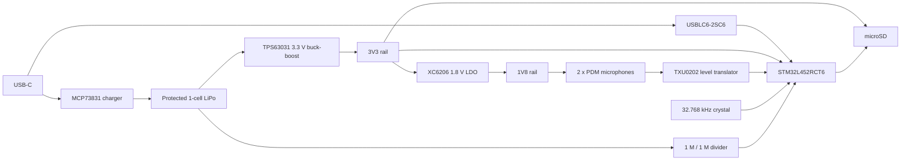

# Hardware Overview

## Purpose

DayVault is a continuously worn voice recorder. Two digital MEMS microphones feed an
STM32L452, which converts PDM audio to low-rate PCM, writes files to microSD, and exposes
recordings through USB-C. A 400 mAh single-cell Li-polymer battery is the intended source.

## Functional architecture

## Power rails

| Rail | Source | Consumers | Notes |
| --- | --- | --- | --- |
| `USB_5V` | USB-C VBUS | MCP73831, USB ESD clamp, USB-detect divider | Present only while USB is attached. |
| `BAT` | Protected LiPo / charger VBAT | TPS63031, battery ADC divider | Approximately 3.0 to 4.2 V. |
| `3V3` | TPS63031 | MCU, microSD, VDDUSB, level shifter, 1.8 V LDO | Converter `EN` is tied to `BAT`, so this rail is always enabled while the battery is connected. |
| `1V8` | XC6206P182MR | Both microphones and TXU0202 VCCA/OE | LDO has no enable pin. Stopping PDM clock puts microphones into sleep but does not remove power. |

## Audio path

1. STM32 `PC2/DFSDM1_CKOUT` produces `PDM_CLK_3V3`.
2. TXU0202 channel B2-to-A2 translates the clock to `PDM_CLK` at 1.8 V.
3. Both SPH0655 microphones share `PDM_CLK` and `PDM_DATA`.
4. U1 `SELECT` is low and U2 `SELECT` is high, so they drive opposite clock edges.
5. TXU0202 channel A1-to-B1 translates `PDM_DATA` to `PDM_DATA_3V3`.
6. The current schematic and PCB send data to `PB12/DFSDM1_DATIN1`; PB1 is unconnected.

This assignment supports the intended consecutive Channel 1/Channel 0 single-wire stereo
topology. It is verified in the saved design and API-exported netlist, but dual-channel
firmware and physical audio capture are still unverified. See `06-Known-Issues.md`.

## Storage path

The TF-01A microSD socket uses SPI1:

| Signal | MCU | Card pin |
| --- | --- | --- |
| `SD_CS` | PA4 | 2 / DAT3-CS |
| `SD_SCK` | PA5 | 5 / CLK |
| `SD_MISO` | PA6 | 7 / DAT0 |
| `SD_MOSI` | PA7 | 3 / CMD |

`SD_CS` has a 10 kOhm pull-up to 3.3 V. Card-detect pin 9 is currently unconnected.

## USB path

- Connector D+/D- pairs are joined by orientation into `USB_DP_CONN` and `USB_DM_CONN`.
- USBLC6-2SC6 protects both data lines and clamps to `USB_5V`/GND.
- Protected `USB_DP` and `USB_DM` connect to PA12 and PA11.
- CC1 and CC2 each use a 5.1 kOhm Rd resistor to ground, identifying DayVault as a USB sink/device.
- `USB_5V` is divided by R9/R10 to `USB_DETECT`; PA9 reads approximately 2.5 V when attached.
- C26, 10 nF from `USB_DETECT` to GND, filters insertion transients.

The MCU ROM USB DFU bootloader is selected by holding BOOT, pressing RESET, releasing
RESET, and then releasing BOOT while USB is connected.

## Charging

MCP73831 charges the single-cell battery from `USB_5V`. R5 is 10 kOhm, selecting about
100 mA nominal charge current. STAT is not connected, so charging state is not available
to firmware. The design has no system power-path/load-sharing circuit: active system
current flows from the same BAT node used by the charger and can interfere with charge
termination.

## Timekeeping

- X1 is a 32.768 kHz, 7 pF crystal on PC14/PC15.
- C24 and C25 are 10 pF load capacitors.
- STM32 VBAT is connected to 3.3 V, so RTC survives MCU Standby while 3.3 V remains alive.
- RTC time is lost after battery protection disconnects the pack or the battery is removed.
- Firmware should accept a trusted timestamp from the host whenever USB is connected.

## Battery measurement

R7 and R8 form a 1 MOhm / 1 MOhm divider from `BAT` to `BAT_SENSE`; C23 is 100 nF to
ground. PA0 measures half the battery voltage. At a 4.2 V battery, the ADC input is about
2.1 V. The source resistance is high, so use a long ADC sample time and allow at least
250 ms after power-up for the RC node to settle before relying on the first reading.
