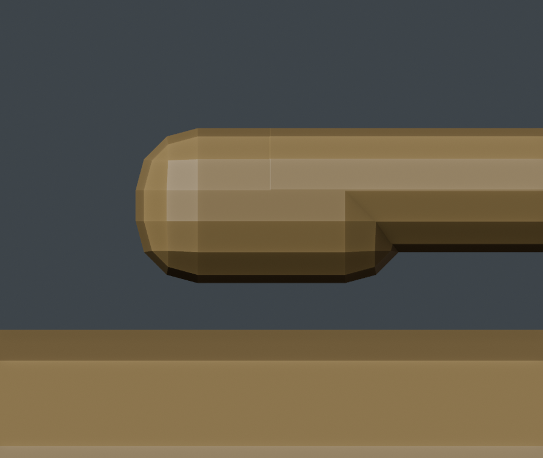
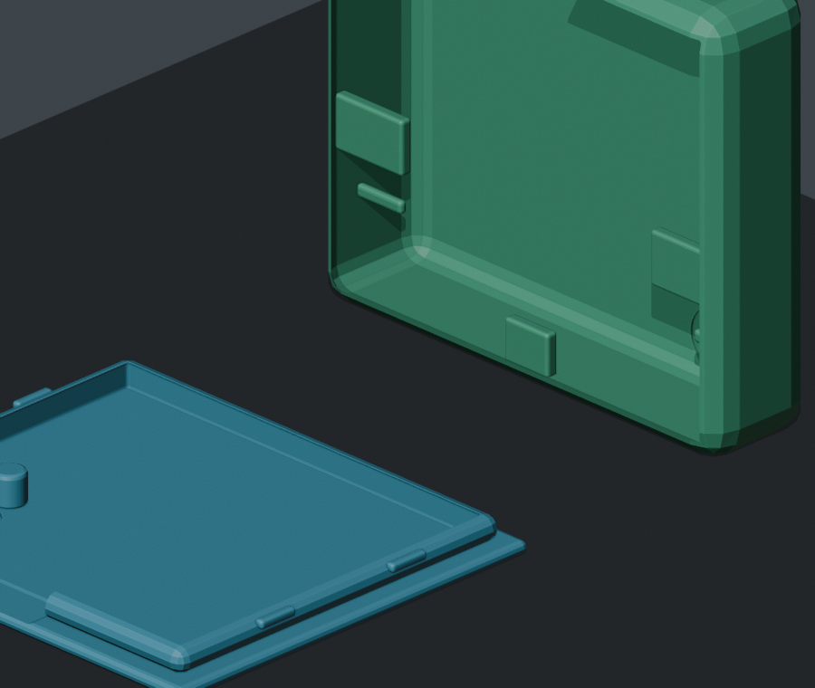

# DayVault Mechanical Enclosure

This directory contains the parameterized two-part chest-clip enclosure for DayVault.
The model targets a 0.4 mm-nozzle FDM printer and a 503040 LiPo battery.

## Printable parts

- `exports/DayVault_FrontCover.stl`
- `exports/DayVault_RearShell_Clip.stl`

The assembled body is nominally 46 x 40 x 15.2 mm, excluding the clip projection. Normal
walls are 1.2 mm. The integrated PETG clip remains 1.6 mm thick.

Only three external openings are present:

1. U1 forward microphone on the PCB lower-left coordinate, through the front cover.
2. U2 rear microphone on the PCB upper-right coordinate, through the rear shell.
3. Bottom USB-C charging and data port.

The microSD card, RESET, and BOOT controls require opening the enclosure.

The integrated chest clip is a true one-ended cantilever. Its upper root is fused to the
rear shell; the lower retention lip is free and keeps 0.6 mm clearance from the shell.



## Regenerating in Blender

Open Blender's scripting workspace and run:

```python
import importlib
import Mechanical.enclosure_config as ec
import Mechanical.dayvault_enclosure as dv

importlib.reload(ec)
importlib.reload(dv)
dv.build_all(r"C:\Users\Administrator\Desktop\DayVault\Mechanical")
```

The script rebuilds the complete assembly, checks each print object for manifold edges,
one connected island, positive signed volume, then saves:

- `DayVault_Enclosure.blend`
- two binary STL files
- front, rear, side, exploded, and acoustic-section PNG previews

Reference objects are named `REF_*` and are excluded from STL export.

## First print

- Material: PETG
- Layer height: 0.20 mm
- Line width: 0.40 mm
- Perimeters: 3
- Top/bottom layers: 5
- Infill: 25-35%
- Brim: 8-10 mm on the rear shell
- Supports: disabled by default
- Elephant-foot compensation: 0.15-0.20 mm if available

The exported STLs already have their intended print orientation:



- Print the front cover with its flat outer face on the bed and the locating pin upward.
- Print the rear shell in its exported narrow-edge orientation. Its rear wall and clip
  stand vertically; the STL is approximately 46 x 14.2 x 40 mm in this orientation.
- Do not use the slicer's auto-orient feature on the rear shell and do not place its open
  cavity against the bed. That orientation creates a large unsupported bridge.
- Inspect the sliced layers before printing. No support should fill the enclosure cavity,
  clip gap, acoustic paths, or USB-C opening.

Before final assembly, check PCB edge fit, battery clearance, USB-C plug insertion, both
microphone paths, the four snap detents, and repeated clip flexing. Do not force or rigidly
compress the LiPo pouch.
