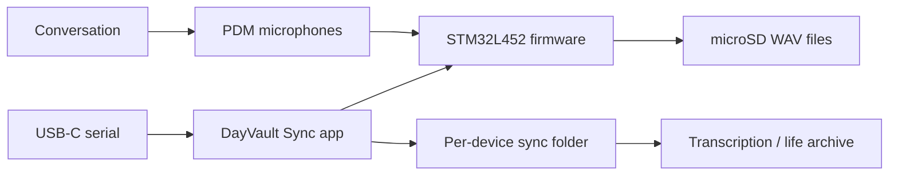

<h1 align="center">DayVault</h1>

<p align="center">
  A wearable microphone module and Windows sync app for turning everyday audio into a local, searchable life archive.
</p>

<p align="center">
  <a href="README.zh-CN.md">简体中文</a> &middot;
  <a href="#quickstart">Quickstart</a> &middot;
  <a href="#project-gallery">Gallery</a> &middot;
  <a href="tools/dayvault_sync/README.md">Sync app</a> &middot;
  <a href="Docs/README.md">Hardware docs</a> &middot;
  <a href="Docs/Serial-Command-Reference.md">Serial protocol</a>
</p>

<p align="center">
  
  
  
  
  
</p>

<p align="center">
  
</p>

## What Changed Recently

DayVault is no longer only a hardware design archive. The latest work adds a Windows desktop sync tool for the microphone module: plug the device into the computer at night, and the app detects it, synchronizes its clock, lists new recordings, and downloads audio files into a per-device folder.

Recent repository updates include:

- A PySide6 `DayVault Sync` desktop app with a device selector, file table, sync folder picker, tray residence, and manual sync button.
- English as the default UI language, with a saved Chinese language switch.
- Newest-first recording lists based on timestamped `REC-YYYYMMDD-HHMM...WAV` filenames.
- Device add/remove and sync start/finish/error logging to `%APPDATA%\DayVault\logs\app.log`.
- Single-EXE packaging support through `tools/dayvault_sync/build_exe.bat`.
- Firmware-side recording, timestamp naming, USB serial protocol, DFU entry, battery handling, and circular-recording work tracked in recent commits.

## Project Gallery

<table>
  <tr>
    <td width="50%" align="center">
      
      <br />
      <strong>Windows sync app.</strong> Detects the microphone module over USB serial and downloads nightly recordings to the computer.
    </td>
    <td width="50%" align="center">
      
      <br />
      <strong>Microphone module.</strong> A compact board and battery prototype used for local audio capture experiments.
    </td>
  </tr>
  <tr>
    <td width="50%" align="center">
      
      <br />
      <strong>Schematic.</strong> The current EasyEDA electrical design for the recorder module.
    </td>
    <td width="50%" align="center">
      
      <br />
      <strong>PCB layout.</strong> The board layout snapshot used for review and bring-up planning.
    </td>
  </tr>
</table>

## Why This Exists

DayVault is built around a simple workflow: carry a small audio recorder during the day, plug it into a computer at night, and let the desktop sync app pull the new `.WAV` files into a local archive. Those files can then be transcribed and indexed off-device.

The repository keeps the full chain visible:

| Layer | What is here |
| --- | --- |
| Hardware | EasyEDA project, exported netlist, schematic/PCB snapshots, pin maps, BOM, and hardware docs. |
| Firmware | PlatformIO STM32 firmware sources and tests for recording, storage, USB protocol, WAV writing, and device behavior. |
| Desktop sync | PySide6 Windows app that watches for the DayVault USB serial device and downloads unsynced audio files. |
| Protocol docs | Serial command reference for listing, downloading, time sync, DFU, battery diagnostics, and file management. |

## Quickstart

### Run The Windows Sync App

```powershell
cd tools/dayvault_sync
pip install -r requirements.txt
python main.py
```

Build a single executable:

```bat
cd tools\dayvault_sync
build_exe.bat
```

The packaged app is written to `tools\dayvault_sync\dist\DayVaultSync.exe`.

### Build Firmware

```powershell
cd firmware
platformio run
```

Run firmware tests when PlatformIO environments are available:

```powershell
cd firmware
platformio test
```

## Sync App Behavior

- Watches USB serial ports for the DayVault device VID/PID.
- Starts sync automatically when a device is inserted.
- Sends host time and local timezone offset to the device on each sync.
- Lists remote recordings and downloads files that are new or whose size changed.
- Writes files to `<sync_folder>\<device_serial>\`.
- Uses `.part` temporary files and retries failed downloads up to three times.
- Keeps state in `%APPDATA%\DayVault\state\<serial>.json`.
- Keeps logs in `%APPDATA%\DayVault\logs\app.log`.
- Minimizes to the system tray instead of exiting when the tray is available.

## Hardware At A Glance

| Subsystem | Selected part | Role |
| --- | --- | --- |
| Main controller | STM32L452RCT6 | PDM capture, storage, USB, RTC, and power-state control. |
| Microphones | 2 x SPH0655LM4H-1-8 | Digital PDM speech capture. |
| Storage | microSD over SPI1 | Local `.WAV` recording storage. |
| USB | USB-C full-speed device | Sync, serial protocol, charging input, and DFU path. |
| Power | Protected single-cell LiPo + TPS63031 | Wearable power source and 3.3 V rail. |
| Charging | MCP73831 | USB-powered Li-ion charging. |
| Timekeeping | STM32 RTC + 32.768 kHz crystal | Timestamped recording names. |

## System Architecture



## Repository Map

```text
DayVault/
|-- EDA/                         EasyEDA project and exported netlist
|-- Docs/                        Hardware and protocol documentation
|-- firmware/                    PlatformIO STM32 firmware
|-- tools/dayvault_sync/          Windows desktop sync app
|-- README.md
`-- README.zh-CN.md
```

## Useful Entry Points

- [Sync app documentation](tools/dayvault_sync/README.md)
- [Hardware documentation index](Docs/README.md)
- [Serial command reference](Docs/Serial-Command-Reference.md)
- [Hardware overview](Docs/01-Hardware-Overview.md)
- [MCU pinout](Docs/02-MCU-Pinout.md)
- [BOM](Docs/07-BOM.md)
- [Contributing guide](CONTRIBUTING.md)

## Current Status

DayVault is an active prototype, not a finished consumer product. The hardware, firmware, and sync tool are all evolving together. Treat this repository as a development record and working prototype source, not as a manufacturing release.

Known practical notes:

- Recording and sync behavior should be validated with real devices and logs.
- Firmware, battery thresholds, storage behavior, acoustic quality, and long-duration reliability still need measured bring-up evidence.
- The desktop sync tool is Windows-focused and depends on Python, PySide6, and pyserial when run from source.
- No open-source license has been selected yet.

## Privacy And Safety

DayVault is intended for personal recording. Recording other people may require notice or consent depending on local law and context. Protect raw audio and transcripts with strong access controls and decide retention rules before collecting sensitive conversations.

This is an unvalidated wearable electronics prototype with a Li-ion battery and charger. Use protected cells, verify polarity, provide strain relief, test charging temperature, and do not leave early hardware unattended while charging or recording.

## License

No open-source license has been selected yet. Unless a license is added later, all rights remain with the repository owner; published design and source files may be inspected but are not automatically licensed for reuse, modification, or redistribution.
