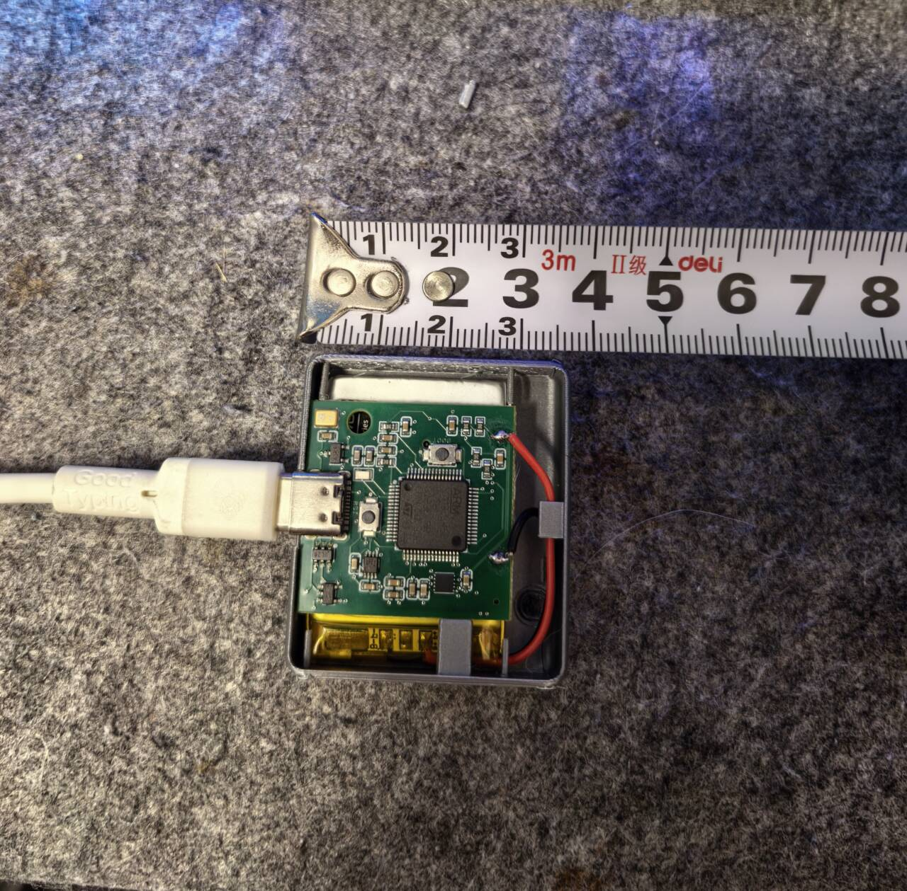
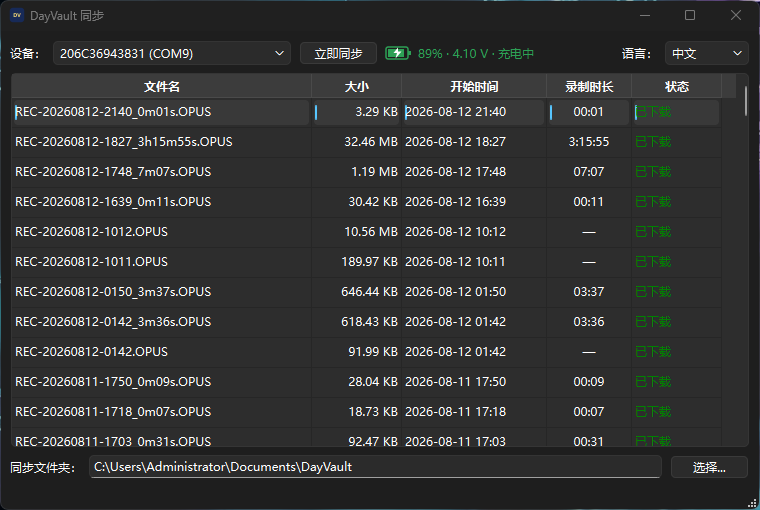
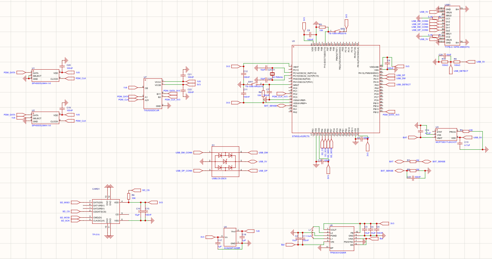
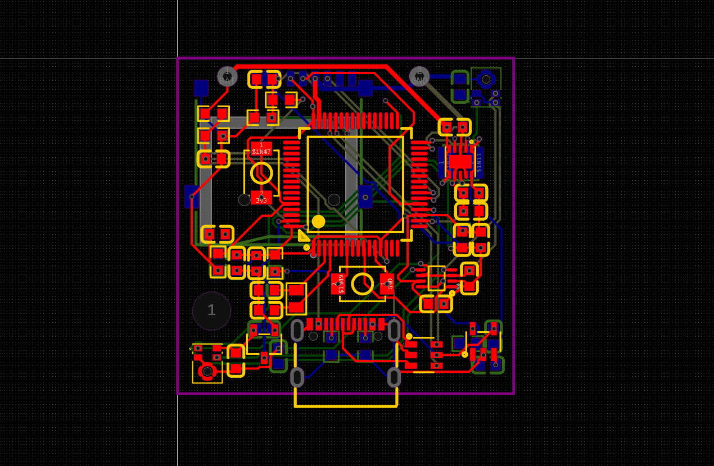

<h1 align="center">DayVault</h1>

  A compact wearable recorder that captures everyday speech as Ogg Opus files and transfers them to a local life archive.

  <a href="README.zh-CN.md">简体中文</a> ·
  <a href="https://github.com/Ha22yX/DayVault/releases/latest">Latest release</a> ·
  <a href="Docs/README.md">Hardware docs</a> ·
  <a href="tools/dayvault_sync/README.md">Sync app</a> ·
  <a href="Docs/Serial-Command-Reference.md">Protocol</a>

  
  
  
  
  

<table>
  <tr>
    <td width="50%" align="center">
      
       
      <strong>Working hardware prototype</strong> 
      STM32 board, battery, USB-C, microSD, and a lightweight printed enclosure.
    </td>
    <td width="50%" align="center">
      
       
      <strong>Windows sync app</strong> 
      Newest-first recordings, readable sizes, duration, battery level, and charging state.
    </td>
  </tr>
</table>

## What DayVault Does

DayVault is a complete personal audio-recording chain:

1. Two PDM microphones capture speech from opposite sides of a chest-worn device.
2. STM32L452 firmware adaptively fuses both channels into one 16 kHz mono stream.
3. Audio is encoded directly to Ogg Opus at a target 24 kbit/s and stored on microSD.
4. The Windows app detects the device over USB and synchronizes recordings into a folder for transcription and archiving.

No parallel WAV or raw PCM copy is kept during normal recording. At 24 kbit/s, continuous audio is roughly 260 MB per day before filesystem overhead.

## Why I Built It

I wanted a small device that could stay with me throughout the day and preserve conversations and moments I would otherwise forget. At night, I can transfer the recordings, turn them into text, and keep a searchable record of what happened.

## Current Capabilities

| Area | Implemented behavior |
| --- | --- |
| Recording | Dual SPH0655 PDM capture, adaptive fusion, 16 kHz mono Ogg Opus, 20 ms frames, 24 kbit/s target. |
| Storage | Timestamped recordings on microSD, safe finalization, resumable downloads, CRC32 verification, and circular cleanup support. |
| USB | USB-C CDC control, WinUSB bulk transfer, time synchronization, charging detection, and software or ROM DFU paths. |
| Power | Battery measurement on PA0, low-voltage protection, STOP2 sleep, RTC wake checks, and USB-aware recovery. |
| Desktop | Automatic sync, newest-first list, readable sizes, start time, duration, battery and charging display, open, locate, save-as, and confirmed deletion. |
| Enclosure | Two-part FDM-printable chest-clip enclosure with microphone and USB openings. |

## Hardware

| Subsystem | Part | Role |
| --- | --- | --- |
| MCU | STM32L452RCT6 | Audio capture, Opus pipeline, storage, USB, RTC, and power management. |
| Microphones | 2 × SPH0655LM4H-1-8 | Opposing digital PDM speech capture. |
| Storage | microSD over SPI1 | Local Ogg Opus recording storage. |
| USB | USB-C Full Speed | Sync, control protocol, charging input, and DFU. |
| 3.3 V rail | TPS63031 | Buck-boost supply from the single-cell battery. |
| Charger | MCP73831T-2ACI/OT | 4.20 V single-cell Li-ion/LiPo charging. |
| Timekeeping | STM32 RTC + 32.768 kHz crystal | Stable timestamps and low-power wake checks. |

  
  

## Download

The [latest GitHub Release](https://github.com/Ha22yX/DayVault/releases/latest) contains:

- <code>DayVaultSync-v1.1.0.exe</code> - packaged Windows synchronization app.
- <code>DayVault-firmware-v1.1.0.bin</code> - STM32L452 firmware image.
- SHA-256 checksums in the release notes.

Firmware updates must target DFU alternate interface 0 at <code>0x08000000</code>. Never write alternate interface 1 or the option-byte region at <code>0x1FFF7800</code>.

## Development

Run the desktop app from source:

    cd tools/dayvault_sync
    pip install -r requirements.txt
    python main.py

Build the Windows executable:

    cd tools\dayvault_sync
    build_exe.bat

Build the firmware:

    cd firmware
    platformio run -e dayvault

Run the maintained tests:

    cd tools/dayvault_sync
    python -m pytest -q

    cd ../../
    python -m pytest -q Mechanical/tests

## Repository Map

| Path | Contents |
| --- | --- |
| <code>EDA/</code> | EasyEDA project and exported hardware data. |
| <code>Docs/</code> | Hardware, pinout, battery, recording, and serial protocol documentation. |
| <code>firmware/</code> | PlatformIO STM32 firmware and native tests. |
| <code>Mechanical/</code> | Blender enclosure source, generator, tests, STL files, and renders. |
| <code>tools/dayvault_sync/</code> | PySide6 Windows synchronization app. |

## Documentation

- [Hardware overview](Docs/01-Hardware-Overview.md)
- [MCU pinout](Docs/02-MCU-Pinout.md)
- [Component pinout](Docs/03-Component-Pinout.md)
- [BOM](Docs/07-BOM.md)
- [Opus recording](Docs/09-Opus-Recording.md)
- [High-speed transfer](Docs/High-Speed-Transfer.md)
- [Serial command reference](Docs/Serial-Command-Reference.md)
- [Mechanical enclosure](Mechanical/README.md)

## Project Status

DayVault is an active hardware prototype. Recording, Opus storage, USB synchronization, battery reporting, low-voltage sleep, and the printed enclosure are working on the current board. Long-duration reliability, acoustic tuning across more wearing conditions, charging thermals, and enclosure revisions still need continued real-world testing.

## Privacy And Safety

Recording other people may require notice or consent depending on local law and context. Protect recordings and transcripts as sensitive personal data.

This is a wearable Li-ion prototype. Use a protected cell, verify polarity, test charging temperature, provide strain relief, and do not leave early hardware unattended while charging.

## License

No open-source license has been selected. Unless a license is added later, all rights remain with the repository owner.
