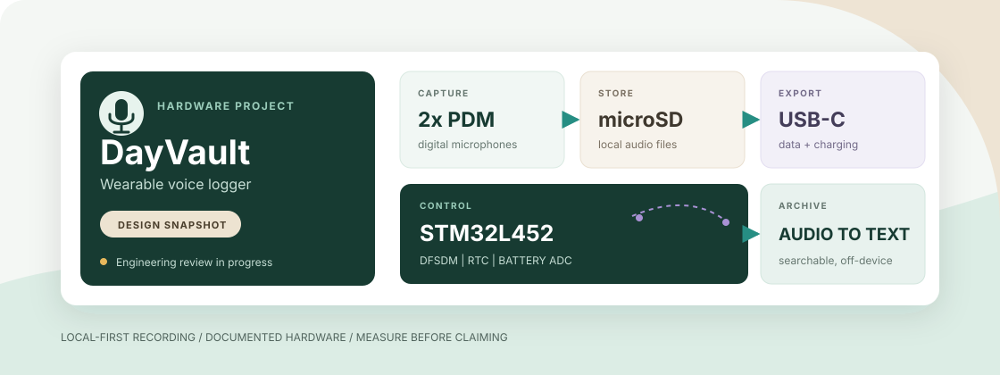
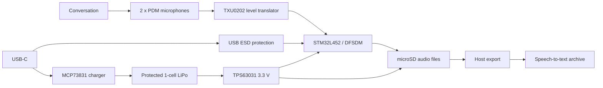

<h1 align="center">DayVault</h1>

<p align="center">
  A documented hardware design for a compact, battery-powered voice logger that records a day locally and turns it into a searchable personal archive.
</p>

<p align="center">
  <a href="README.zh-CN.md">简体中文</a> &middot;
  <a href="Docs/README.md">Hardware docs</a> &middot;
  <a href="Docs/06-Known-Issues.md">Known issues</a> &middot;
  <a href="CONTRIBUTING.md">Contributing</a>
</p>

<p align="center">
  
  
  
  
  
</p>

<p align="center">
  
</p>

## Why DayVault

Phones can record conversations, but they are not designed to be a small, predictable,
all-day capture device. DayVault explores a dedicated alternative: two low-power digital
microphones feed an STM32, audio is stored locally on microSD, and recordings are exported
over USB-C for offline speech-to-text and personal archiving.

The project is intentionally hardware-first. This repository preserves the EasyEDA design,
an API-exported netlist, a complete MCU pin map, bring-up guidance, and an explicit list of
unresolved risks. It does **not** yet contain production firmware or manufacturing-ready PCB
outputs.

| Design goal | Current approach |
| --- | --- |
| Wearable, all-day capture | 400 mAh protected single-cell LiPo and low-power STM32L452 |
| Intelligible speech rather than studio audio | 2 x SPH0655LM4H-1-8 PDM microphones |
| Local and inspectable storage | Removable microSD over SPI1 |
| One connector for charging and data | USB-C with USB Full Speed, ROM DFU, and 100 mA charging |
| Reliable timestamps | STM32 RTC with a 32.768 kHz crystal |
| Host-side life archive | Export audio, then transcribe and index it off-device |

## Hardware At A Glance

| Subsystem | Selected part | Role |
| --- | --- | --- |
| Main controller | STM32L452RCT6 | DFSDM/PDM capture, storage, USB, RTC, and power-state control |
| Microphones | 2 x SPH0655LM4H-1-8 | 1.8 V PDM speech capture with opposite channel selection |
| Level translation | TXU0202DCUR | Fixed-direction translation between 1.8 V PDM and 3.3 V MCU logic |
| Storage | TF-01A microSD socket | SPI1 audio storage |
| Main power | TPS63031DSKR | Fixed 3.3 V buck-boost from the LiPo cell |
| Microphone power | XC6206P182MR | Fixed 1.8 V LDO |
| Charging | MCP73831T-2ACI/OT | Single-cell linear charger, programmed for about 100 mA |
| USB protection | USBLC6-2SC6 | ESD protection for USB D+ and D- |
| Timekeeping | 32.768 kHz crystal | STM32 RTC clock while the 3.3 V backup domain is alive |
| Intended battery | Protected 802525 LiPo, 3.7 V, 400 mAh | Wearable power source; runtime still requires measurement |

## System Architecture



## Current Status

DayVault is a **design snapshot**, not a finished recorder. The documentation separates
saved connections from proposed revisions so future firmware and PCB work can start from a
known state.

| Area | Status | Evidence / next action |
| --- | --- | --- |
| Schematic | Archived | EasyEDA source and exported netlist are versioned |
| Pin documentation | Documented | Complete STM32L452 64-pin map and net-centric map are included |
| Mono PDM bring-up | Electrically planned | Current snapshot routes PDM data to `PB1/DFSDM1_DATIN0` |
| Dual-microphone stereo | Revision required | Move PDM data to `PB12/DFSDM1_DATIN1`, then validate paired DFSDM channels |
| PCB synchronization | Blocked | USB-detect parts are not synchronized from schematic to PCB |
| PCB layout | Blocked | DRC, ground plane, power routing, USB routing, and SWD access need review |
| Firmware | Not included | The repository currently provides a firmware design guide, not an implementation |
| Manufacturing | Not ready | Do not generate or order production files from this revision |

The tracked blockers and design risks live in
[Docs/06-Known-Issues.md](Docs/06-Known-Issues.md). That file is the release gate, not a
wish list.

## Repository Map

```text
DayVault/
|-- EDA/
|   |-- DayVault.eprj2          EasyEDA Pro project snapshot
|   |-- DayVault.netlist.json   API-exported schematic netlist
|   `-- Backups/                EasyEDA automatic backups
|-- Docs/
|   |-- 00-开发速查.md           Chinese development quick reference
|   |-- 01-Hardware-Overview.md Architecture and power domains
|   |-- 02-MCU-Pinout.md        Complete firmware-facing pin assignment
|   |-- 03-Component-Pinout.md  Major component connections
|   |-- 04-Firmware-Guide.md    CubeMX and firmware behavior
|   |-- 05-Bringup-and-Test.md  Safe first-power validation sequence
|   |-- 06-Known-Issues.md      Blockers, limitations, and required revisions
|   |-- 07-BOM.md               Parts and passive values
|   `-- 08-Net-Map.md           Net-centric endpoint map
|-- CONTRIBUTING.md
|-- README.md
`-- README.zh-CN.md
```

## Start Here

1. Read the [documentation index](Docs/README.md) and the
   [known-issues register](Docs/06-Known-Issues.md).
2. Open [EDA/DayVault.eprj2](EDA/DayVault.eprj2) in EasyEDA Pro to inspect the editable
   project snapshot.
3. Use [EDA/DayVault.netlist.json](EDA/DayVault.netlist.json) as a review artifact, not as
   a replacement for the editable source.
4. Follow [Docs/05-Bringup-and-Test.md](Docs/05-Bringup-and-Test.md) before powering a
   prototype.
5. Base firmware pin assignments on [Docs/02-MCU-Pinout.md](Docs/02-MCU-Pinout.md), then
   update the documents whenever the schematic changes.

## Storage Envelope

These figures are capacity estimates, not implemented codec claims:

| Recording format | Approximate data per 24 hours | Trade-off |
| --- | ---: | --- |
| 16 kHz, 16-bit mono PCM | 2.76 GB | Simplest capture and recovery path |
| IMA ADPCM mono | 691 MB | Lower storage with modest MCU complexity |
| Opus at 12-24 kbit/s | 130-259 MB | Best storage efficiency, but substantially more firmware work |

Actual runtime and intelligibility depend on firmware duty cycle, microSD write behavior,
converter efficiency, microphone mechanics, enclosure design, and the chosen codec. They
must be measured on the assembled device.

## Bring-Up Roadmap

- [ ] Resolve the PDM input assignment and synchronize schematic and PCB.
- [ ] Clear electrical and manufacturing DRC violations.
- [ ] Add a continuous ground plane and review converter, power, USB, and microSD routing.
- [ ] Add accessible SWDIO, SWCLK, NRST, 3V3, and GND recovery pads.
- [ ] Validate all rails and charging behavior with current-limited bench power.
- [ ] Capture one microphone to RAM, then verify mono files on multiple microSD cards.
- [ ] Validate two-channel PDM only after the PB12 hardware revision.
- [ ] Implement power-fail file closure, battery thresholds, RTC synchronization, and USB export.
- [ ] Measure 24-hour energy use, thermal behavior, acoustic mechanics, and real speech intelligibility.

## Privacy And Safety

DayVault is intended for personal recording. Recording other people may require notice or
consent depending on local law and context. Protect raw audio and transcripts with strong
access controls, and define a retention policy before collecting sensitive conversations.

This is an unvalidated wearable electronics design containing a Li-ion battery and charger.
Use a protected cell, verify polarity, provide strain relief, test charging temperature, and
do not wear or leave the prototype unattended while its electrical and thermal behavior is
still unknown.

## Contributing

Hardware review, documentation corrections, firmware experiments, and measured bring-up
results are welcome. Read [CONTRIBUTING.md](CONTRIBUTING.md) before opening a pull request.
Please attach evidence to hardware claims: net names, reference designators, datasheet
sections, DRC output, scope captures, or reproducible test steps.

## License

No open-source license has been selected yet. Unless a license is added later, all rights
remain with the repository owner; the published design files may be inspected but are not
automatically licensed for reuse, modification, or redistribution.
