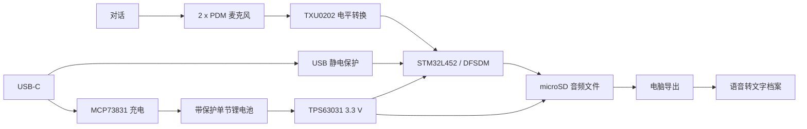

<h1 align="center">DayVault</h1>

<p align="center">
  一套面向全天语音记录的紧凑型电池供电开源硬件设计，将一天的录音留在本地，再整理为可检索的人生档案。
</p>

<p align="center">
  <a href="README.md">English</a> &middot;
  <a href="Docs/README.md">硬件文档</a> &middot;
  <a href="Docs/06-Known-Issues.md">已知问题</a> &middot;
  <a href="CONTRIBUTING.md">参与贡献</a>
</p>

<p align="center">
  
  
  
  
  
</p>

<p align="center">
  
</p>

## 为什么做 DayVault

手机可以录音，但它并不是为小体积、可预测、全天持续采集而设计的专用设备。
DayVault 探索的是另一条路线：两颗低功耗数字麦克风把音频送入 STM32，录音保存在
本地 microSD，晚上再通过 USB-C 导出，离线完成语音识别和个人档案整理。

这个项目当前以硬件为先。仓库保存了 EasyEDA 工程、通过 API 导出的网表、完整 MCU
引脚表、上电调试流程，以及明确列出的未解决风险。仓库目前**没有**可直接使用的量产
固件，也**没有**可直接投产的 PCB 输出。

| 设计目标 | 当前方案 |
| --- | --- |
| 可佩戴、全天记录 | 400 mAh 带保护单节锂电池与低功耗 STM32L452 |
| 重点保证人声可懂度，而非录音棚音质 | 2 颗 SPH0655LM4H-1-8 PDM 麦克风 |
| 数据保存在本地且可直接检查 | SPI1 连接的可拆卸 microSD |
| 一个接口完成充电和数据传输 | USB-C、USB Full Speed、ROM DFU 与约 100 mA 充电 |
| 文件拥有可靠时间戳 | STM32 RTC 与 32.768 kHz 晶振 |
| 在电脑端建立人生档案 | 导出音频后，在设备外完成转写和索引 |

## 硬件概览

| 子系统 | 当前器件 | 作用 |
| --- | --- | --- |
| 主控 | STM32L452RCT6 | DFSDM/PDM 采集、存储、USB、RTC 与功耗状态控制 |
| 麦克风 | 2 x SPH0655LM4H-1-8 | 1.8 V PDM 人声采集，两颗设置为相反声道选择 |
| 电平转换 | TXU0202DCUR | 在 1.8 V PDM 与 3.3 V MCU 逻辑之间做固定方向转换 |
| 存储 | TF-01A microSD 卡座 | 通过 SPI1 保存音频 |
| 主电源 | TPS63031DSKR | 将单节锂电池升降压为固定 3.3 V |
| 麦克风电源 | XC6206P182MR | 固定 1.8 V LDO |
| 充电 | MCP73831T-2ACI/OT | 单节锂电线性充电，设定电流约 100 mA |
| USB 保护 | USBLC6-2SC6 | USB D+、D- 静电保护 |
| 计时 | 32.768 kHz 晶振 | 在 3.3 V 备份域仍供电时维持 STM32 RTC |
| 计划使用的电池 | 带保护 802525，3.7 V，400 mAh | 可佩戴电源；实际续航仍需实测 |

## 系统架构



## 当前状态

DayVault 目前是一份**设计快照**，还不是完成的录音设备。文档明确区分“工程中已经
保存的连接”和“下一版必须修改的内容”，方便后续固件与 PCB 开发从确定状态开始。

| 范围 | 状态 | 依据 / 下一步 |
| --- | --- | --- |
| 原理图 | 已归档 | EasyEDA 可编辑源文件和导出网表已经纳入版本管理 |
| 引脚文档 | 已记录 | 包含 STM32L452 完整 64 引脚表和按网络整理的连接表 |
| PDM 布线 | 已更新、未实测 | PDM 数据已接到 `PB12/DFSDM1_DATIN1`，PB1 为 NC |
| 双麦克风立体声 | 需要固件与样机验证 | Channel 1 直连，Channel 0 重定向，并使用相反采样边沿 |
| 网表一致性 | 阻塞 | 原理图和 PCB 均为 50 个器件，但严格 DRC 仍报告 1 个网表不一致 |
| PCB 布局 | 阻塞 | 仍有 58 个间距错误，并需处理地平面、电源、USB 和 SWD 调试入口 |
| 固件 | 尚未纳入仓库 | 当前只有固件设计指南，没有可运行实现 |
| 生产 | 尚不可投产 | 不要基于这一版生成或下单生产文件 |

所有阻塞项和设计风险统一记录在
[Docs/06-Known-Issues.md](Docs/06-Known-Issues.md)。它是版本放行门槛，不是随手列出的愿望清单。

## 仓库结构

```text
DayVault/
|-- EDA/
|   |-- DayVault.eprj2          EasyEDA Pro 工程快照
|   |-- DayVault.netlist.json   通过 API 导出的原理图网表
|   `-- Backups/                EasyEDA 自动备份
|-- Docs/
|   |-- 00-开发速查.md           中文开发入口
|   |-- 01-Hardware-Overview.md 系统架构与电源域
|   |-- 02-MCU-Pinout.md        面向固件的完整引脚关系
|   |-- 03-Component-Pinout.md  主要器件连接关系
|   |-- 04-Firmware-Guide.md    CubeMX 与固件行为建议
|   |-- 05-Bringup-and-Test.md  安全上电与验证流程
|   |-- 06-Known-Issues.md      阻塞项、限制与必要修改
|   |-- 07-BOM.md               器件和无源元件参数
|   `-- 08-Net-Map.md           按网络整理的端点关系
|-- CONTRIBUTING.md
|-- README.md
`-- README.zh-CN.md
```

## 从这里开始

1. 先阅读[文档索引](Docs/README.md)和[已知问题清单](Docs/06-Known-Issues.md)。
2. 使用 EasyEDA Pro 打开 [EDA/DayVault.eprj2](EDA/DayVault.eprj2)，检查可编辑工程快照。
3. 将 [EDA/DayVault.netlist.json](EDA/DayVault.netlist.json) 作为审查产物，不要把它当作
   可编辑源文件的替代品。
4. 给样机上电前，严格执行 [Docs/05-Bringup-and-Test.md](Docs/05-Bringup-and-Test.md)。
5. 固件引脚以 [Docs/02-MCU-Pinout.md](Docs/02-MCU-Pinout.md) 为准；原理图修改后必须同步
   更新文档。

## 存储量估算

下面只是容量估算，不代表这些编码已经实现：

| 录音格式 | 连续 24 小时约占用 | 取舍 |
| --- | ---: | --- |
| 16 kHz、16-bit 单声道 PCM | 2.76 GB | 最容易采集、恢复和排查 |
| IMA ADPCM 单声道 | 691 MB | 用较低 MCU 复杂度换取更小体积 |
| Opus 12-24 kbit/s | 130-259 MB | 存储效率最高，但固件工作量明显更大 |

实际续航和清晰度还会受到固件工作周期、microSD 写入行为、转换效率、麦克风机械结构、
外壳与编码方式影响，必须在整机样品上测量。

## 调试路线

- [ ] 解决 DRC 中剩余的网表不一致，并重新导出同步网表。
- [ ] 清除电气和生产相关 DRC 问题。
- [ ] 增加连续地平面，重新审查转换器、电源、USB 和 microSD 布线。
- [ ] 增加可接触的 SWDIO、SWCLK、NRST、3V3 和 GND 救援焊盘。
- [ ] 使用限流电源验证所有电源轨和充电行为。
- [ ] 先把一颗麦克风采集到 RAM，再用多张 microSD 验证单声道文件。
- [ ] 先验证 Channel 1 单声道，再验证重定向 Channel 0 和双路同时采集。
- [ ] 实现掉电前关文件、电池阈值、RTC 对时和 USB 导出。
- [ ] 实测 24 小时能耗、温升、声学结构和真实对话可懂度。

## 隐私与安全

DayVault 用于个人记录。在不同地区和使用场景中，录制他人可能需要明确告知或取得同意。
在采集敏感对话前，应为原始音频和转写内容设置严格访问控制，并先确定保存期限。

这是一套尚未验证、包含锂电池与充电器的可佩戴电子设计。必须使用带保护电芯、检查极性、
提供导线应力释放并测试充电温度。在电气和热行为尚未确认前，不要佩戴样机，也不要让它在
无人看管时充电或工作。

## 参与贡献

欢迎提交硬件审查、文档纠错、固件实验和可重复的上电测试结果。发起 Pull Request 前请先阅读
[CONTRIBUTING.md](CONTRIBUTING.md)。硬件结论应附带证据，例如网络名、位号、数据手册章节、
DRC 输出、示波器波形或可复现测试步骤。

## 许可证

项目目前尚未选择开源许可证。在后续添加许可证之前，所有权利仍归仓库所有者；公开的设计
文件可以被查看，但并不自动授予复用、修改或再分发的许可。
