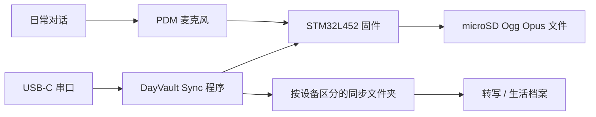

<h1 align="center">DayVault</h1>

<p align="center">
  一个随身麦克风模块和 Windows 同步程序，用来把每天的音频记录沉淀成本地、可检索的生活档案。
</p>

<p align="center">
  <a href="README.md">English</a> &middot;
  <a href="#快速开始">快速开始</a> &middot;
  <a href="#项目图片">项目图片</a> &middot;
  <a href="tools/dayvault_sync/README.md">同步程序</a> &middot;
  <a href="Docs/README.md">硬件文档</a> &middot;
  <a href="Docs/Serial-Command-Reference.md">串口协议</a>
</p>

<p align="center">
  
  
  
  
  
</p>

<p align="center">
  
</p>

## 项目图片

<table>
  <tr>
    <td width="50%" align="center">
      
      <br />
      <strong>Windows 同步程序。</strong> 通过 USB 串口识别麦克风模块，并把夜间插入后的录音同步到电脑。
    </td>
    <td width="50%" align="center">
      
      <br />
      <strong>麦克风模块。</strong> 用于本地音频采集实验的紧凑电路板与电池原型。
    </td>
  </tr>
  <tr>
    <td width="50%" align="center">
      
      <br />
      <strong>原理图。</strong> 当前 EasyEDA 电气设计，用于记录和审查录音模块硬件。
    </td>
    <td width="50%" align="center">
      
      <br />
      <strong>PCB 布局。</strong> 当前板级布局快照，用于硬件审查和上电计划。
    </td>
  </tr>
</table>

## 为什么需要它

我做 DayVault 的起点，是因为最近在学习 PCB 设计，所以想做一个真正属于自己的硬件项目：一个全天候录音设备，能够把我的每一天、每一句话都录制下来，作为我的人生存档。

我设想的工作流很简单：白天随身带着麦克风模块，晚上把它插到电脑上，让 Windows 同步程序自动把新增 `.OPUS` 录音同步到本地文件夹；之后再通过语音转文字和 AI 总结，把每天发生的事情整理成文字记录。

仓库保留了完整链路：

| 层 | 仓库中包含的内容 |
| --- | --- |
| 硬件 | EasyEDA 工程、导出网表、原理图/PCB 截图、引脚表、BOM 和硬件文档。 |
| 固件 | PlatformIO STM32 固件源码，以及录音、存储、USB 协议、Ogg Opus 写入和设备行为相关测试。 |
| 桌面同步 | PySide6 Windows 程序，监听 DayVault USB 串口设备并下载未同步音频。 |
| 协议文档 | 串口命令参考，覆盖文件列表、下载、时间同步、DFU、电池诊断和文件管理。 |

## 快速开始

### 运行 Windows 同步程序

```powershell
cd tools/dayvault_sync
pip install -r requirements.txt
python main.py
```

打包成单文件 EXE：

```bat
cd tools\dayvault_sync
build_exe.bat
```

打包产物位于 `tools\dayvault_sync\dist\DayVaultSync.exe`。

### 构建固件

```powershell
cd firmware
platformio run
```

当 PlatformIO 环境可用时运行固件测试：

```powershell
cd firmware
platformio test
```

## 同步程序行为

- 监听 USB 串口，识别 DayVault 设备 VID/PID。
- 设备插入后自动开始同步。
- 每次同步都会把电脑时间和本地时区偏移发送到设备。
- 读取设备录音列表，并下载新增或大小变化的文件。
- 文件写入 `<同步文件夹>\<设备序列号>\`。
- 下载时使用 `.part` 临时文件，失败最多重试 3 次。
- 每台设备的下载状态保存在 `%APPDATA%\DayVault\state\<序列号>.json`。
- 运行日志保存在 `%APPDATA%\DayVault\logs\app.log`。
- 系统托盘可用时，关闭窗口会最小化到托盘而不是退出。

## 音频录音

生产录音是标准 Ogg Opus `.OPUS` 文件：两个麦克风先自适应融合为精确 16 kHz 的单声道，再以 20 ms 帧、目标 24 kbit/s 受限 VBR restricted-SILK 配置编码。每天录音约占 265 MB。不保留并行 WAV 或 PCM 原始文件；已有的 `.WAV` 旧录音仍可导出，也会参与循环删除。

文件命名、正常停止、断电边界和 `OPUSSTAT` 见 [Opus 录音说明](Docs/09-Opus-Recording.md)。

## 硬件概览

| 子系统 | 当前器件 | 作用 |
| --- | --- | --- |
| 主控 | STM32L452RCT6 | PDM 采集、存储、USB、RTC 与功耗状态控制。 |
| 麦克风 | 2 x SPH0655LM4H-1-8 | 数字 PDM 人声采集。 |
| 存储 | SPI1 连接 microSD | 本地 Ogg Opus `.OPUS` 录音存储；旧 `.WAV` 仍可导出。 |
| USB | USB-C Full Speed Device | 同步、串口协议、充电输入和 DFU 路径。 |
| 电源 | 带保护单节锂电 + TPS63031 | 可佩戴供电与 3.3 V 电源轨。 |
| 充电 | MCP73831 | USB 供电锂电充电。 |
| 时间 | STM32 RTC + 32.768 kHz 晶振 | 支持带时间戳的录音文件名。 |

## 系统架构



## 仓库结构

```text
DayVault/
|-- EDA/                         EasyEDA 工程与导出网表
|-- Docs/                        硬件和协议文档
|-- firmware/                    PlatformIO STM32 固件
|-- tools/dayvault_sync/          Windows 桌面同步程序
|-- README.md
`-- README.zh-CN.md
```

## 常用入口

- [同步程序文档](tools/dayvault_sync/README.md)
- [硬件文档索引](Docs/README.md)
- [串口命令参考](Docs/Serial-Command-Reference.md)
- [硬件概览](Docs/01-Hardware-Overview.md)
- [MCU 引脚表](Docs/02-MCU-Pinout.md)
- [BOM](Docs/07-BOM.md)
- [贡献指南](CONTRIBUTING.md)

## 当前状态

DayVault 是一个正在推进的原型项目，不是已经完成的消费级产品。硬件、固件和同步程序仍在一起演进。请把这个仓库视为开发记录和工作原型源码，而不是量产发布包。

当前需要注意：

- 录音和同步行为仍应结合真实设备与日志验证。
- 固件、电池阈值、存储行为、声学质量和长时间可靠性仍需要实测上电证据。
- 桌面同步程序当前面向 Windows；源码运行依赖 Python、PySide6 和 pyserial。
- 项目目前还没有选择开源许可证。

## 隐私与安全

DayVault 用于个人记录。在不同地区和使用场景中，录制他人可能需要明确告知或取得同意。采集敏感对话前，请为原始音频和转写内容设置严格访问控制，并先确定保存期限。

这是一套尚未完全验证、包含锂电池与充电器的可佩戴电子原型。必须使用带保护电芯、检查极性、提供导线应力释放并测试充电温度。在电气和热行为尚未确认前，不要让早期硬件无人看管地充电或录音。

## 许可证

项目目前尚未选择开源许可证。在后续添加许可证之前，所有权利仍归仓库所有者；公开的设计和源码文件可以被查看，但并不自动授予复用、修改或再分发的许可。
